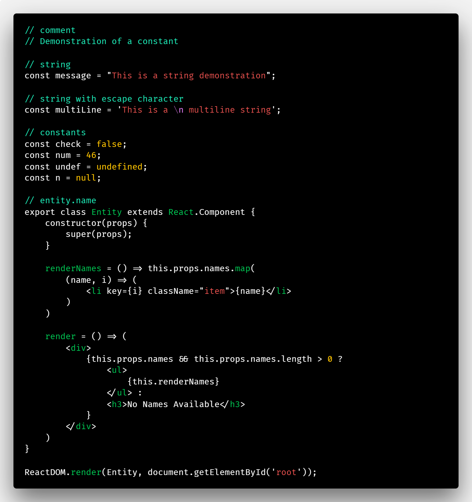

# Nocturnal

A colorful dark theme for VS Code. This is my first theme set, and any feedback is very much welcome!

There are two themes provided:

**Nocturnal**

**Nocturnal Minimal**

This theme was inspired by the awesome [Alabaster](https://github.com/tonsky/vscode-theme-alabaster) theme. I wanted to be able to have a blacked out version for when the minimal syntax highlighting is suitable.

## Acknowledgments

* Colors were selected from the [Material Design](https://material.io/design/color/the-color-system.html#tools-for-picking-colors) color system.

* The minimal version of the theme was inspired by the awesome [Alabaster](https://github.com/tonsky/vscode-theme-alabaster) theme. I wanted to be able to have a blacked out version for when the minimal syntax highlighting is suitable.

* I love the [Hyper Term Theme](https://github.com/HasseNasse/hyper-term-theme) for VS code, but wanted to have a customized color palette and a minimal syntx highlighting version.

## Shades

In the `colors` array in each theme, settings are organized by shade.

Background: `#000000e6`

Foreground: `#f7f7f7`

Alt Background: `#030303`

Selection Background: `#424242`

Selection Highlight Background: `#212121`

Tabs Background: `#363636`

Line Highlight Background: `#070707`

Line Number Foreground: `#ced5ca`

## Colors

Red: `#c62828`

Bright Red: `#e53935`

Magenta: `#673ab7`

Bright Magenta: `#b388ff`

Blue: `#01579b`

Bright Blue: `#0091ea`

Cyan: `#00b8d4`

Bright Cyan: `#00e5ff`

Teal: `#00bfa5`

Bright Teal: `#1de9b6`

Green: `#43a047`

Bright Green: `#00c853`

Yellow: `#ffc400`

Bright Yellow: `#ffff00`

Bright White: `#ffffff`

Black: `#424242`

Bright Black: `#757575`